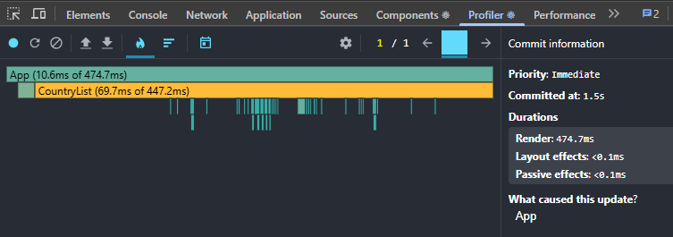
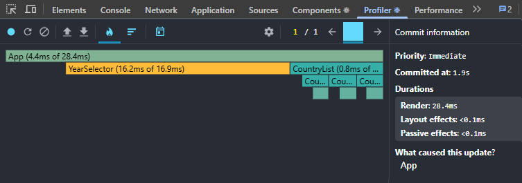
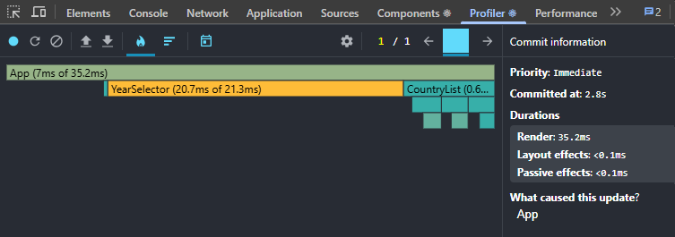
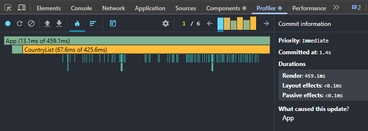

# Performance Optimization Report

## Baseline Measurements

### Interaction A: Sort countries

- **Commit duration**: 0.1 ms
- **Render duration**: 474.7 ms
- **Screenshot**: 

### Interaction B: Search countries

- **Commit duration**: 0.1 ms
- **Render duration**: 28.4 ms
- **Screenshot**: 

### Interaction C: Change year

- **Commit duration**: 0.1 ms
- **Render duration**: 35.2 ms
- **Screenshot**: 

### Interaction D: Toggle column

- **Commit duration**: 0.1 ms
- **Render duration**: 549.1 ms
- **Screenshot**: 
