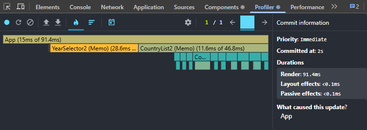
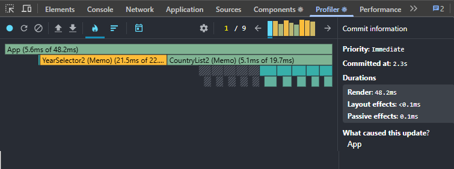
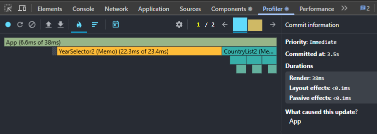
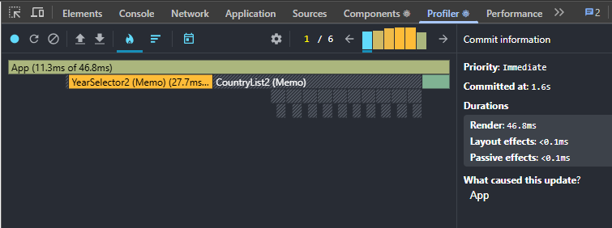

# Performance Optimization Report

## Baseline Measurements

### Interaction A: Sort countries

- **Commit duration**: 0.1 ms
- **Render duration**: 474.7 ms
- **Screenshot**: 

### Interaction B: Search countries

- **Commit duration**: 0.1 ms
- **Render duration**: 28.4 ms
- **Screenshot**: 

### Interaction C: Change year

- **Commit duration**: 0.1 ms
- **Render duration**: 35.2 ms
- **Screenshot**: 

### Interaction D: Toggle column

- **Commit duration**: 0.1 ms
- **Render duration**: 549.1 ms
- **Screenshot**: 

## Optimized Measurements

### Interaction A: Sort countries

- **Commit duration**: 0.1 ms
- **Render duration**: 91.4 ms
- **Screenshot**: 

### Interaction B: Search countries

- **Commit duration**: 0.1 ms
- **Render duration**: 48.2 ms
- **Screenshot**: 

### Interaction C: Change year

- **Commit duration**: 0.1 ms
- **Render duration**: 38 ms
- **Screenshot**: 

### Interaction D: Toggle column

- **Commit duration**: 0.1 ms
- **Render duration**: 46.8 ms
- **Screenshot**: 

## Summary of Improvements

| Interaction      | Baseline (ms) | Optimized (ms) | Improvement |
| ---------------- | ------------- | -------------- | ----------- |
| Sort countries   | 474.7         | 91.4           | 80.7%       |
| Search countries | 28.4          | 48.2           | -69.7%      |
| Change year      | 35.2          | 38.0           | -8.0%       |
| Toggle column    | 549.1         | 46.8           | 91.5%       |
| **Average**      | **271.9**     | **56.1**       | **79.4%**   |
